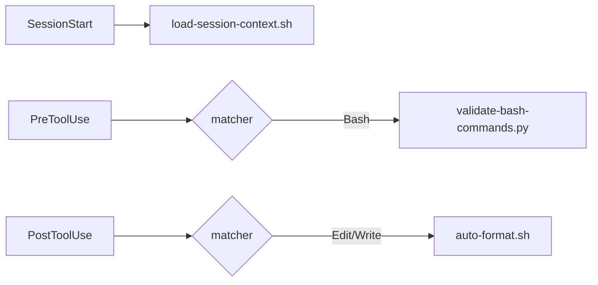

# Claude Code Setup

A comprehensive, production-ready configuration for [Claude Code](https://claude.com/claude-code) demonstrating best practices for customization and automation. This is a reference implementation—fork it, steal what you like, adapt it to your workflow.

## What's Here

- **23 Skills** — Reusable capabilities for auditing, authoring, workflows, and more
- **5 Hooks** — Automation for validation, formatting, and session context
- **8 Rules** — Language and tool-specific coding standards
- **2 Commands** — Quick shortcuts for common operations
- **1 Agent** — Specialized AI agent for code review
- **Decision guides and references** — Help choosing the right component type and naming things consistently

This directory (`~/.claude`) is the global configuration directory for Claude Code. All customizations here apply across projects unless overridden locally.

### Skills by Purpose

#### Quality & Linting

| Skill       | What it does                                                                                             | When to use                                                                         |
| ----------- | -------------------------------------------------------------------------------------------------------- | ----------------------------------------------------------------------------------- |
| `cc-review` | Single-pass lint + quality scoring (1-5) + prioritized improvement recommendations for any customization | Reviewing, auditing, scoring, linting, or improving any skill, hook, agent, or rule |

#### Authoring & Planning

| Skill        | What it does                                                                   | When to use                                                                         |
| ------------ | ------------------------------------------------------------------------------ | ----------------------------------------------------------------------------------- |
| `md-audit`   | Audits and improves CLAUDE.md files against quality templates                  | CLAUDE.md maintenance, reviewing what project instructions should contain           |
| `md-improve` | Analyzes conversation patterns to capture recurring preferences into CLAUDE.md | Claude keeps repeating a mistake, teaching a new preference, consolidating guidance |

#### Code Workflows

| Skill            | What it does                                                                                   | When to use                                                             |
| ---------------- | ---------------------------------------------------------------------------------------------- | ----------------------------------------------------------------------- |
| `tdd-cycle`      | Enforces strict red-green-refactor TDD cycles with phase gates                                 | Test-driven development, writing tests first, making failing tests pass |
| `refactor-clean` | Detects code smells and applies structured improvements (decomposition, SOLID, extract-method) | Code is too complex, hard to maintain, or has duplication               |
| `tech-debt`      | Classifies, prioritizes, and roadmaps technical debt                                           | Auditing debt, assessing code quality, analyzing maintenance burden     |

#### Shipping & Syncing

| Skill     | What it does                                                                             | When to use                                   |
| --------- | ---------------------------------------------------------------------------------------- | --------------------------------------------- |
| `vc-ship` | End-to-end git workflow: branch creation, atomic commits, history cleanup, PR submission | Shipping code or preparing changes for review |
| `vc-sync` | Switches to main, pulls from remote, cleans merged branches                              | Syncing local repo after a PR merges          |

#### Language Quality Gates

| Skill                     | What it does                                                    | When to use                                      |
| ------------------------- | --------------------------------------------------------------- | ------------------------------------------------ |
| `go-quality-gate`         | Go formatting, static analysis, and tests                       | Checking Go code quality, running go lint        |
| `bash-quality-gate`       | Shell script formatting, static analysis, and portability       | Checking shell script quality, linting bash code |
| `python-quality-gate`     | Python formatting, linting, type checking, and tests            | Checking Python quality, linting with ruff       |
| `typescript-quality-gate` | TypeScript/JavaScript formatting, linting, type checking, tests | Checking TS/JS quality, linting with biome       |

#### Issue & Release

| Skill         | What it does                                                                   | When to use                                                 |
| ------------- | ------------------------------------------------------------------------------ | ----------------------------------------------------------- |
| `fix-issue`   | Plans, implements, reviews, and ships a fix for a GitHub issue                 | Fixing GitHub issues, resolving bugs, implementing requests |
| `pre-release` | Validates a project is ready to tag and ship with a 16-check gate              | Before tagging a release, cutting a version, shipping       |
| `walkthrough` | Reads source code and produces a linear, executable walkthrough using showboat | Explaining how code works, onboarding, code tours           |

#### Discovery & Meta

| Skill                       | What it does                                                                            | When to use                                                                |
| --------------------------- | --------------------------------------------------------------------------------------- | -------------------------------------------------------------------------- |
| `cc-automation-recommender` | Analyzes a codebase and recommends Claude Code automations (hooks, skills, MCP servers) | Setting up Claude Code for a project, optimizing workflows, best practices |
| `last30days`                | Researches any topic from the last 30 days across Reddit, X, YouTube, HN, and the web   | Current topics, trending discussions, recommendations, community opinions  |
| `session-review`            | Extracts patterns, preferences, and learnings from the current session                  | Retrospectives, debriefs, reflecting on insights worth remembering         |
| `let-fate-decide`           | Draws 4 Tarot cards to inject entropy into planning when prompts are vague              | Ambiguous prompts, feeling lucky, multiple equally valid approaches        |

## Installation

Don't install this. Just steal what you like.

## Quick Start

1. **Customize your settings**
   - Edit `settings.json` to adjust tool permissions and MCP servers
   - Edit `CLAUDE.md` to document your coding principles and preferences

2. **Create customizations**
   - Use `/create-agent [name]` to build specialized agents
   - Use `/create-skill [name]` to create reusable capabilities
   - Use `/create-command [name]` to build quick shortcuts
3. **Review the decision guides**
   - `references/decision-matrix.md` - Component selection, scenarios, and migration paths

## Directory Structure

### Configuration Files (tracked in git)

| File               | Purpose                                                               |
| ------------------ | --------------------------------------------------------------------- |
| `settings.json`    | Global permissions, MCP servers, cleanup policies, and tool approvals |
| `CLAUDE.md`        | Instructions for Claude when working in this repository               |
| `.gitignore`       | Git ignore rules for this configuration directory                     |
| `.prettierrc.json` | Prettier formatter configuration                                      |
| `.prettierignore`  | Files excluded from Prettier formatting                               |
| `biome.json`       | Biome linter/formatter configuration for TS/JS/JSON                   |
| `taskfile.yml`     | go-task runner commands (brew updates, system maintenance)            |

### Extension Directories (tracked in git)

| Directory     | Purpose                                         |
| ------------- | ----------------------------------------------- |
| `agents/`     | Specialized AI agents for specific workflows    |
| `skills/`     | Reusable capabilities and knowledge domains     |
| `hooks/`      | Event-driven automation and validation          |
| `rules/`      | Language and tool-specific coding standards     |
| `references/` | Shared decision guides and naming conventions   |
| `.github/`    | GitHub workflows, Dependabot, and repo settings |

### Session and Runtime Data (not tracked in git)

| Path               | Purpose                                     |
| ------------------ | ------------------------------------------- |
| `projects/`        | Per-project metadata and usage tracking     |
| `todos/`           | Session-scoped todo lists                   |
| `tasks/`           | Task tracking state                         |
| `plans/`           | Implementation plans from plan mode         |
| `file-history/`    | Change tracking for edited files            |
| `session-env/`     | Environment snapshots per session           |
| `sessions/`        | Session state and conversation data         |
| `debug/`           | Session debug output                        |
| `shell-snapshots/` | Shell environment captures                  |
| `cache/`           | Temporary cached data                       |
| `paste-cache/`     | Clipboard paste buffer cache                |
| `backups/`         | Configuration file backups                  |
| `learned/`         | Claude's learned preferences (auto-managed) |
| `reflections/`     | Session reflection documents                |
| `plugins/`         | Installed plugin data                       |
| `ide/`             | IDE integration state                       |
| `telemetry/`       | Usage telemetry data                        |
| `usage-data/`      | Aggregated usage statistics                 |
| `stats-cache.json` | Cached statistics data                      |
| `history.jsonl`    | Conversation history across sessions        |

## Customizing Your Setup

### Creating Agents

**When to use**: Build specialized assistants for complex tasks requiring specific tools, models, or focused behavior.

Create a markdown file in `agents/` with YAML frontmatter:

- Define purpose and scope
- Select model (Sonnet/Haiku/Opus)
- Configure tool restrictions
- Write focus areas and approach

**Examples**: Read-only analyzers, code generators, domain-specific experts

### Creating Skills

**When to use**: Encapsulate domain knowledge, best practices, or complex workflows.

Create a directory in `skills/` with a `SKILL.md` file:

- Define capability and trigger patterns
- Structure with progressive disclosure
- Organize supporting documentation
- Configure allowed tools

**Examples**: Best practices, deployment procedures, workflow automation

### Creating Hooks

**When to use**: Automate validation, formatting, logging, or policy enforcement without explicit prompting.

Create a shell script in the `hooks/` directory, then configure it in `settings.json`:

```json
{
  "hooks": {
    "PreToolUse": [
      {
        "matcher": "Bash",
        "hooks": [
          {
            "type": "command",
            "command": "~/.claude/hooks/my-hook.sh",
            "timeout": 5
          }
        ]
      }
    ]
  }
}
```

Exit codes: `0` = allow, `2` = block, anything else = fail gracefully

**Examples**: Auto-formatting, frontmatter validation, session context loading

## Configuration Reference

### Permissions Model

Claude Code requires explicit permissions for tool operations. Configure in `settings.json`:

```json
{
  "permissions": {
    "allow": ["Read", "Bash(git:*)", "Write(*.md)"],
    "deny": ["Read(.env*)", "Bash(sudo:*)"]
  }
}
```

- **Allowed**: Operations that don't require user approval
- **Denied**: Explicitly blocked operations
- **Everything else**: Requires explicit approval

### Security Considerations

These are already configured in this setup:

- `.env*` files are blocked from reading
- Lock files (`go.sum`, `package-lock.json`, etc.) are write-protected
- `sudo` commands are denied by default
- `.mcp.json` contains API credentials (GitHub token)—not tracked in git
- `history.jsonl` may contain sensitive context—not tracked in git

### Active Hooks

This configuration includes 4 hooks:

#### Hook Execution Flow



#### Validation Hooks (PreToolUse)

- **validate-bash-commands.py** - Suggests better tool alternatives (Read instead of cat, Grep instead of grep, etc.)

#### Formatting Hooks (PostToolUse)

- **auto-format.sh** - Automatically formats code files (gofmt for Go, prettier for JS/TS/JSON/Markdown)

#### Session Hooks (SessionStart)

- **load-session-context.sh** - Injects git repository context at session start

#### Status Line

- **statusline-command.sh** - Renders directory, git branch, model, and context percentage

## Common Operations

### Inspect Project Metadata

```bash
# List tracked projects
ls -l projects/

# View specific project stats
cat projects/-Users-markayers-source-mine-go/meta.json | jq
```

### Manual Cleanup

Claude Code automatically cleans session data older than 30 days. For manual cleanup:

```bash
# Remove old session data
find todos/ -name "*.json" -mtime +30 -delete
find debug/ -name "*.txt" -mtime +30 -delete
```

## Contributing

See [CONTRIBUTING.md](CONTRIBUTING.md) for guidelines on submitting improvements, bug reports, or new customizations.

## Resources

- [Claude Code Documentation](https://claude.com/code)
- [MCP Server Specification](https://modelcontextprotocol.io)
- [GitHub Issues](https://github.com/anthropics/claude-code/issues)

## License

MIT License - see [LICENSE](LICENSE) for details.

---

**Last Updated**: 2026-03-13
